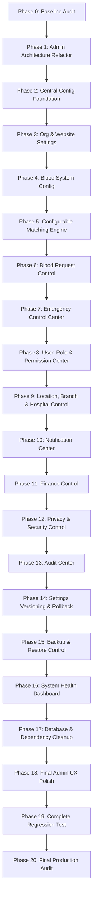

# ROKTOBONDHON — ADMIN CONTROL CENTER ARCHITECTURE & BASELINE AUDIT
**Document Version:** 1.0.0  
**Phase:** Phase 0 — Discovery & Safety Baseline  
**Date:** 2026-09-06  
**Repository:** [https://github.com/bdyusuf2016/roktobondhon](https://github.com/bdyusuf2016/roktobondhon)

---

## 1. Executive Summary & Current Architecture

**রক্তবন্ধন (RoktoBondhon)** is a production-oriented voluntary blood donation web platform with high performance and accessibility for Bengali and English users.

### Tech Stack & Runtime:
- **Frontend Core:** React 19, TypeScript 5.8, Vite 6.2, Tailwind CSS 4.1, Lucide React, Motion.
- **State & Context Layer:**
  - `DataContext.tsx`: Core domain entity state store (Donors, Blood Requests, Donations, Hospitals, Locations, Branches, Funds, Users, Camps, Audit Logs, Role Permissions Matrix). Supports real-time simulation / fallback caching.
  - `OrgConfigContext.tsx`: Local storage & fallback store for organization profile, branding, contacts, and dynamic banners.
  - `AuthContext.tsx`: Authentication state, session handling, user identity persistence, and demo role switcher.
  - `DialogContext.tsx`: Accessible modal dialogs (alerts, confirmations, prompts).
- **Services Architecture (`src/services/`):**
  - `auditService.ts`: Audit trail logging.
  - `authService.ts`: User authentication operations.
  - `bloodRequestService.ts`: Public and verified blood request operations.
  - `donationService.ts`: Donation record logging and verification.
  - `donorRequestService.ts`: Direct donor match dispatching.
  - `donorService.ts`: Donor registration, verification, search, public/private queries.
  - `fundService.ts`: Donations and disbursement accounting.
  - `hospitalService.ts`: Hospital directory management.
  - `idGenerator.ts`: Deterministic formatted ID generation (`DNR-...`, `BD-...`, `DN-...`).
  - `locationService.ts`: Division/District/Upazila/Union hierarchy.
  - `matchingService.ts`: Blood compatibility and ranking algorithm.
  - `notificationService.ts`: System notifications and alerts.
  - `permissions.ts`: RBAC permission matrix checks.
  - `storageService.ts`: Document and photo upload handling.
  - `userService.ts`: User accounts and roles.

---

## 2. Current Admin Features & Architecture Pain Points

### Current Admin Capabilities (in `AdminDashboardPage.tsx`):
1. **Overview Dashboard:** Live KPI statistics for total donors, active emergency requests, completed donations, funds, and hospitals.
2. **Donor Management:** Table view of all registered donors, verification status toggle (`verified`, `pending`, `rejected`, `suspended`), search, and filter.
3. **Blood Request Management:** Live request tracker, verification badge approval, status transition (`pending`, `active`, `matched`, `fulfilled`, `cancelled`), emergency level tags.
4. **Donation Logging:** Record official donation verification with units, donation type (Whole Blood, Platelets, etc.), verifier name, and hospital association.
5. **Hospital Directory:** Full CRUD operations for hospitals, emergency numbers, ambulance hotline, 24/7 status, and ICU/Blood Bank flags.
6. **Fund & Financial Transparency:** Management of donor cash contributions, approval workflow, disbursement records with voucher numbers, and payment method configurations (bKash, Nagad, Rocket, Bank).
7. **User Management & RBAC Matrix:** User list, role assignment (`super_admin`, `admin`, `moderator`, `volunteer`, `donor`, `recipient`), and interactive permission toggle matrix.
8. **Branch & Location Management:** Multi-tier location hierarchy (Division ➔ District ➔ Upazila ➔ Union/Area) and branch coordinator contact management.
9. **Blood Camps Management:** Creating and managing community blood donation drives and viewing pre-registered donor rosters.
10. **Data Backup & Restore:** JSON export and import with structure validation.
11. **Audit Logs:** Chronological timeline of administrative actions and changes.
12. **Settings:** Basic organization name, emergency hotline, slogan, and announcement banner text.

### Current Architectural Pain Points:
- **Monolithic File Size:** `src/pages/AdminDashboardPage.tsx` is currently over **2,700 lines of code**, combining multiple sub-tabs, form modals, table renders, and state logic in a single file.
- **Dispersed Configuration:** Business rules (matching weights, donation intervals, eligibility ages/weights, emergency thresholds, request expiry) are hard-coded in TypeScript constants rather than being configurable by administrators.
- **Need for Modularization:** Separating admin sections into standalone modular pages (`/admin/settings/*`, `/admin/users/*`, `/admin/blood-system/*`) will vastly improve maintainability, testing, and security isolation.

---

## 3. Existing Data Collections / Tables & Schema

| Table / Collection | Purpose | Security / Privacy Boundary |
| :--- | :--- | :--- |
| `users` | User accounts, roles, auth IDs, contact numbers | Public profile viewable; roles modified only by Super Admin |
| `donors` | Combined public directory + private donor details | `privacy` JSONB flags controls whether phone/age/NID is exposed |
| `donor_private` / `DonorPrivate` | Strictly protected private donor details (NID, exact address, admin notes) | Access strictly limited to authorized admins/volunteers |
| `blood_requests` | Patient blood needs, urgency, hospital, contacts | Publicly readable; verifiable by volunteers/admins |
| `donor_requests` | 1-to-1 match requests sent to specific donors | Visible only to target donor and requester |
| `donations` | Historical donation records & certificates | Donor & authorized staff/admins |
| `hospitals` | Hospital and blood bank directory | Publicly readable; editable by Admins |
| `blood_camps` | Community blood drive schedules and venues | Publicly readable; manageable by Admins/Volunteers |
| `camp_registrations` | Pre-registered donors for upcoming camps | Public registration; manageable by Admins |
| `fund_donations` | Voluntary donations (bKash/Nagad/Bank) | Publicly visible transparency log; verified by Admins |
| `fund_disbursements`| Approved fund releases & receipts | Public financial transparency log |
| `payment_methods` | bKash/Nagad merchant/personal numbers | Public instructions; credentials restricted |
| `notifications` | User-targeted notifications & alerts | Private to user or broadcast |
| `audit_logs` | Immutable audit trail of administrative actions | Append-only; accessible only by Super Admin/Admin |
| `verification_logs` | Donor verification audit trail | Authorized staff and Admins |

---

## 4. Existing Roles & Permissions Baseline

### Defined Roles:
1. `super_admin`: Full root control over all system modules, compatibility rules, permissions matrix, and backups.
2. `admin`: Full operations management (donors, requests, donations, hospitals, funds, settings, users).
3. `moderator`: Regional manager (e.g. Dhamrai branch) managing local donors, requests, and hospitals.
4. `volunteer`: Field worker recording donations and verifying blood requests.
5. `donor`: Registered blood donor viewing own history, pocket card, and incoming requests.
6. `recipient`: Blood seeker managing own blood requests.

### Defined Permission Keys:
- `manage_donors`
- `manage_requests`
- `record_donation`
- `manage_hospitals`
- `manage_branches`
- `manage_funds`
- `manage_disbursements`
- `manage_payment_methods`
- `manage_users`
- `manage_roles_matrix`
- `manage_settings`
- `manage_backup`
- `view_audit_logs`

---

## 5. Existing Configuration Sources & Hard-Coded Business Rules

### Current Configuration Sources:
- Environment Variables (`.env`, `.env.example`):
  - `GEMINI_API_KEY`: Google Gemini API credentials.
  - `APP_URL`: App host URL.
  - `VITE_DEMO_MODE`: Local simulation / sandbox preview toggle.
  - `VITE_BASE_PATH`: Base path for deployment.
  - `VITE_SUPABASE_URL`, `VITE_SUPABASE_ANON_KEY`: Database client credentials.
- `OrgConfigContext.tsx`: Local storage backed store for organization details and announcement banner.
- Local constants in services and component files.

### Hard-Coded Rules Identified for Centralization:
1. **Blood Compatibility:** Fixed ABO/Rh compatibility map in `src/services/matchingService.ts`.
2. **Matching Engine Weights:** Hard-coded scoring points (Blood: 40 pts, Availability: 25 pts, Verification: 15 pts, Proximity: 10 pts, Emergency: 10 pts).
3. **Donor Eligibility Criteria:**
   - Minimum donation interval: 90 days (male) / 120 days (female).
   - Minimum age: 18 years, Maximum age: 65 years.
   - Minimum weight: 45 kg (general) / 50 kg (male ideal).
4. **Blood Request Operational Rules:**
   - Maximum units per request: Hard-coded in form validation.
   - Request expiration duration: Default 24-48 hours.
5. **Emergency Mode & Notifications:**
   - Emergency banner display toggles.
   - Broadcast message template strings.

---

## 6. Security Boundaries & Invariants

- **Zero Client-Only Security:** All administrative updates, deletions, and configuration changes will validate identity and role against backend policies and create append-only audit entries.
- **Donor Privacy Strict Separation:** `donorPrivate` fields (NID, exact residential address, private phone if opted out) must never be returned to unauthorized public endpoints or non-volunteer roles.
- **Privilege Escalation Prevention:** No user or admin can elevate their own role or another user's role to `super_admin` unless authenticated with existing `super_admin` credentials.

---

## 7. Migration Risks & Mitigation Strategy

1. **Monolith Extraction Risk:** Extracting sub-components from `AdminDashboardPage.tsx` could potentially disrupt state or event handlers.
   - *Mitigation:* Extract components incrementally without modifying business logic contracts; verify builds and lint checks continuously.
2. **Configuration Missing Fallback Risk:** New centralized configuration service must never crash if database documents are missing or malformed.
   - *Mitigation:* Comprehensive fallback default values guaranteed at all levels.
3. **Multi-Database Authority Risk:** Supabase vs Firestore dual source confusion.
   - *Mitigation:* Keep single source of truth clear, maintain compatibility layer, and execute phased cleanup in Phase 17.

---

## 8. Recommended Implementation Sequence (Phases 1 — 20)

---

## 9. Phase 0 Verification Baseline

- **`npm run lint` (`tsc --noEmit`):** Passed (0 errors).
- **`npm run build` (`vite build`):** Passed (0 errors, production assets bundled successfully).
- **Runtime Code Modifications in Phase 0:** None (strictly zero functional changes).

**PHASE 0 STATUS:** ✅ **COMPLETE**
